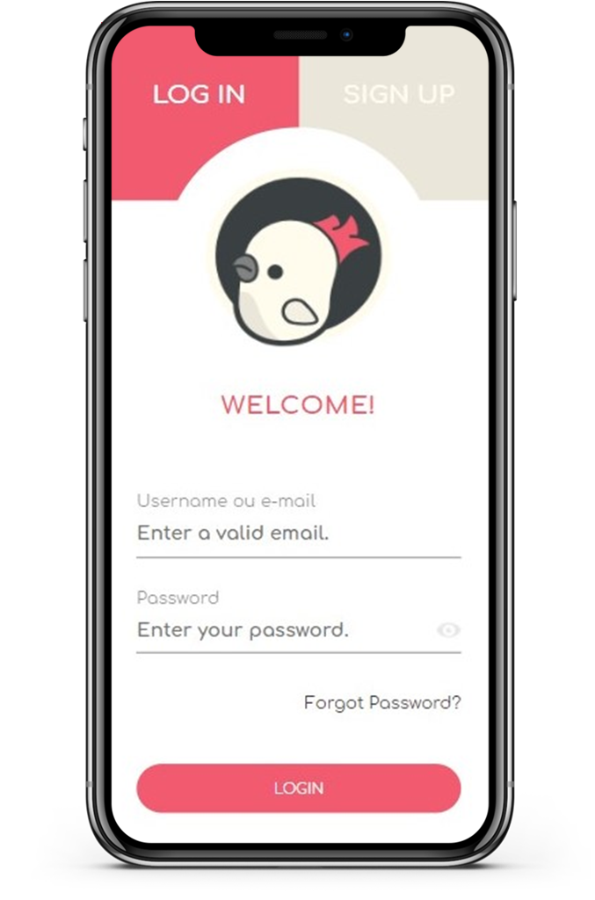
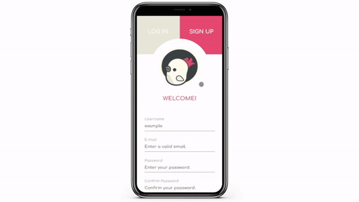

<h1 align="center">
    
</h1>

<p align="center">
  <a href="#-Project">Project</a>&nbsp;&nbsp;&nbsp;|&nbsp;&nbsp;&nbsp;
  <a href="#-Layout">Layoult</a>&nbsp;&nbsp;&nbsp;|&nbsp;&nbsp;&nbsp;
  <a href="#-Technology">Technology</a>&nbsp;&nbsp;&nbsp;|&nbsp;&nbsp;&nbsp;
  <a href="#-Environment">Environment</a>&nbsp;&nbsp;&nbsp;|&nbsp;&nbsp;&nbsp;
  <a href="#%EF%B8%8F-license">License</a>&nbsp;&nbsp;&nbsp;|&nbsp;&nbsp;&nbsp;
  <a href="#-Participants">Participants</a>
</p>
<br>

<p align="center">
  
</p>
<br>

<p align="center">
 
</p>

## 💻 Project

Front-end of <strong>memory match</strong> game made with Javascript. 🎲

The objective of this project is to deepen JavaScript skills, so the whole project was done using this language, even the insertion of HTML and CSS. 🎓

It is the second practical project of the [@CollabCode's](https://collabcode.training/) full-stack web development course.

<br>

## 🎨 Layout
<p align="center">


<br>

## 🔨 Technology

<p align="center">
  
</p>

<br>

## 📝 Environment

1. Clone the repository: 
```bash 
git@github.com:CaioLemec/memory-match.git
```
2. Install node: 
```bash
 https://nodejs.org/en/
 ```
3. Open project folder in VSCode:
```bash
 cd ../memory-match
 ```
4. Install dependencies by using command:
```bash
 npm install
 ```
5. At your terminal set this command line:
```bash
npm run dev
```
7. Access the generated address in your browser:
```bash
adress:8080/
```

<br>

## ⚖️ License

<br>

This project is licensed under the Apache 2.0 [LICENSE](LICENSE.md).

<br>

## 😃 Participants
<br>

<br>
<sub>&nbsp;&nbsp;&nbsp;Caio Lemec</sub>

<br>
<br>


<h3>Caio Lemec<h3>
<a href="https://t.me/caiolemec">
<a href="mailto:caiolemec@gmail.com">
<a href="https://www.linkedin.com/in/caiolemec/">
<br>

<hr>

<p align="center">⭐&nbsp;&nbsp;&nbsp;   Developed by Caio Lemec  &nbsp;&nbsp;&nbsp;⭐</p>
